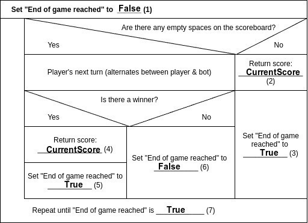
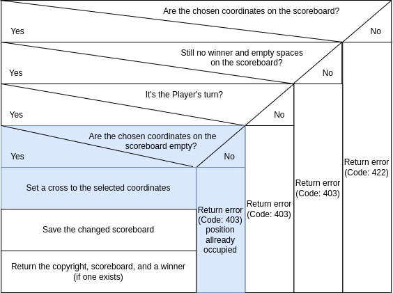

# Apprenticeship Challenge for Fachinformatiker*in Anwendungsentwicklung
You need to successfully solve this challenge, if you want to snatch yourself an apprenticeship at [MÜNSMEDIA GmbH](https://muensmedia.de) as a Fachinformatiker*in Anwendungsentwicklung. 👾 🤖 😎

## Tic-tac-toe
[Tic-tac-toe](https://en.wikipedia.org/wiki/Tic-tac-toe), noughts and crosses, or Xs and Os is a two-player game, that you're probably already familiar with.

## Gameplay / How it works
The game board consists of 9 empty spaces, aligned in a three-by-three grid.
Players alternately place the marks (:x:) and (:o:) in one of the empty spaces.

The player who succeeds in placing three of their marks in a horizontal, vertical, or diagonal row is the winner.
If no winner has been decided after all spaces have been filled, the game ends in a draw.

### Example: Player X has won

### Example: A draw

# Your tasks

## 1.) Complete this structogram

A Nassi–Shneiderman diagram or **structogram** is a diagram to show program drafts as a method for structural programming.

A structogram contains the following structural blocks, that are nested inside or combined with each other:

### Process

Every process (or chain of commands), a program should do, are written inside a rectangle block.

### Case distinction

If the condition is met (true), instruction 1 will run.

If the condition isn't met (false), instruction 2 will run. Instruction blocks can also have multiple instructions.

### Loop with exit condition (While-Do-Loop)

After executing the code inside the loop **at least one time** the condition gets checked the first time. If this is true, the loop gets repeated.

### Complete the structogram for Tic-tac-toe game

We started creating a structogram for the Tic-tac-toe game, but your future trainer Malte isn't sure about the contents from the parts `(1), (2), (3), (4), (5), (6), (7)`.
**Can you help him?**

*Please write down your solutions and include them in your email to us when completed.*

## 2.) Getting ready to code
Now that you know how Tic-tac-toe works, we want to code it together.
Don't worry. Even if you have little to no programming experience, we will get there together. 😉
We want to see and work together on your source code. We use the platform GitHub to share source code freely.

### Please do the following steps:
- [x] You [already own a Github-Account](https://github.com/login)  **or** you [create yourself a free GitHub-Account](https://github.com/join)
- [x] After signing in to GitHub.com:
- [x] Copy our source code to your GitHub-Account. Just [click here](https://github.com/muensmedia/testaufgabe/generate).
  - **Please set the visibility of the new repository - as default - to 'Public'.**
- [x] Now scroll down the newly created GitHub repository until you see these instructions.
- [x] You continue from this point in the repository you have just created.
- [x] [Open Gitpod](https://gitpod.io/workspaces)
- [x] Click `Continue with GitHub`, choose `Authorize gitpod-io` and login with your GitHub-credentials.
- [x] Make sure you are on https://gitpod.io/workspaces.
- [x] By clicking `New Workspace` you create a new programming environment.
- [x] In the opening dialog, select the address of your newly created repository.
- The GitPod workspace should open itself.
- [ ] **Choose `Don't wait for prebuild`**
- Gitpod opens, *this can take some minutes 😳. Please be patient.*
- [x] **In the meantime** open https://gitpod.io/integrations
- [x] In the row `GitHub github.com` click the `three dots` followed by `Edit Permissions`
- [x] Additionally select `public_repo` and `repo` and save with `Update permissions`.
- [x] Confirm your changes with `Authorize gitpod-io` and your password if applicable
- [x] Now open these instructions. To do this, right-click on the file `README.md` and then on `Open Preview`.
- [x] Continue with the instructions in your Gitpod programming environment.

## 3.) Change copyright
Your Tic-tac-toe webapp consists of a frontend and backend part.  
As frontend, we use a tool called `Swagger`, so we can try out API's with a graphical interface.
Swagger is already open, as you open GitPod's programming environment.
As backend, we use a [PHP-App](https://www.php.net/manual/en/), based on the framework [Laravel](https://laravel.com/docs/9.x).  

We have prepared a function that displays this game's copyright. ©️

**Try this API method to display the game's copyright:**
- [x] In Swagger, click on `/copyright`.
- [x] Click on the button `Try it out`.
- [x] Send this request by clicking on `Execute`.
- You can view the output with the current copyright at `Response body`.

✍🏼 **Change copyright:**  
- [x] Open file [app/app/App/Http/Controllers/CopyrightController.php](app/app/App/Http/Controllers/CopyrightController.php) in Gitpod.
- [x] You can find the copyright in a string format on line 18.
- [x] Use the ASCII generator linked in `CopyrightController.php` to create your personal copyright.
- [x] Replace our copyright `By MÜNSMEDIA GmbH` with your own copyright.
- [x] Try your new copyright with Swagger!
- [x] You need to save your changes, also named - **commit** (next section).

#### ✅ Create commit:
  - Click on the Tab `Source Control` on the left or you can press the keys <kbd>Strg</kbd>+<kbd>Shift</kbd>+<kbd>G</kbd> together.
  - You can type a message above to describe your changes as detailed and meaningful as possible. **Please write your message in English, even if you are a native German speaker**.
  - Save your message with <kbd>Strg</kbd><kbd>⏎</kbd>
  - Click on `Yes` in the pop-up window to add all your changes to your commit.
  - **Click on the button `Sync changes`**, to upload your changes to GitHub. Confirm with `OK`.
  - 🎉 You have done your first Git-Commit! 🎊

## 4.) Writing the /play method
You can't play against the bot programmed by the MÜNSMEDIA team yet.
It is still missing the logic it needs when the `/play` API route is called.

### Structogram for a turn
Here is the structogram for one of your turns with the `play()` method.

**To-do:**
- [x] Take your time to look at the structogram for one of your turns!
  - We have highlighted the parts that you still need to implement in the structogram.
- [x] In file [app/app/App/Http/Controllers/GameController.php](app/app/App/Http/Controllers/GameController.php) the `play()` method on line 144 still needs some logic.
  - Please complete the missing logic. We left some comments in the source code to help you get started.
- [x] Now test it in Swagger. The function there is also called `/play`.
- [x] **❌ To reset the scoreboard, you can use the `DELETE /board` method in Swagger**
- [x] ✅ Create a commit (see above `Create commit`)
- [x] 🔁 Click the button `Sync changes` to upload your changes to GitHub.

## 5.) The 🤖 turn - /play-bot
We have already written a 🤖 (bot) for you, so you can play against him.  
Open Swagger and alternate between the `/play` and `/play-bot` API route (the first turn is yours).

## 6.) NO CHEATING! - <kbd>↑</kbd><kbd>↑</kbd><kbd>↓</kbd><kbd>↓</kbd><kbd>←</kbd><kbd>→</kbd><kbd>←</kbd><kbd>→</kbd><kbd>B</kbd><kbd>A</kbd>
Currently, you or the bot can play multiple turns in a row, although you are supposed to take turns.
Of course, it's no fun like that 😞!

**To-do:**
- [x] In file [app/app/App/Http/Controllers/GameController.php](app/app/App/Http/Controllers/GameController.php) the `isAllowedToPlay()` method on line 144 still needs some logic.
  - Please complete the missing logic. We left some comments in the source code to help you get started.
- [x] Thoroughly test your changes in Swagger.
- [x] ✅ Create a commit (see above `Create commit`)
- [x] 🔁 Click the button `Sync changes` to upload your changes to GitHub.

## 7.) Who's the winner? 🏆 
Currently, the game is unable to display a winner.  
Now it's your task, to do this.

**To-do:**
- [x] Currently, the method `whoHasWon()` in [app/app/App/Http/Controllers/GameController.php](app/app/App/Http/Controllers/GameController.php) at line 104 has no game logic.
  - Add the missing logic. We created some hints for you as comments in the code.
- [x] Test your changes with Swagger as detailed as possible.
- [x] ✅ Create a commit (see above `Create commit`)
- [x] 🔁 Click on `Sync changes` to upload your changes to GitHub.

## Additional tasks
You had fun by solving these small tasks above and you want more? **Ok, no problem 😈!**

### 8.) Make the method someoneHasWon() prettier ✨
The method `someoneHasWon()` at [app/app/App/Http/Controllers/GameController.php](app/app/App/Http/Controllers/GameController.php) is currently ugly.  
Can you simplify this, by using some loops?  
It can be useful, to look at **public-methods** from `$game`:
[app/app/Components/GameBoard/GameBoard.php](app/app/Components/GameBoard/GameBoard.php)

**To-do:**
- [x] Make method `someoneHasWon()` prettier
- [x] Test your changes with Swagger as detailed as possible.
- [x] ✅ Create a commit (see above `Create commit`)
- [x] 🔁 Click on `Sync changes` to upload your changes to GitHub.

### 9.) 4x4 Tic-tac-toe 😈
Think about, what you need to change, so we can play a 4x4 Tic-tac-toe.
Also look closer at the class [app/app/Components/GameBoard/GameBoard.php](app/app/Components/GameBoard/GameBoard.php).

**To-do:**
- [ ] Try to make a 4x4 Tic-tac-toe
  - You will need your changes from task 7.)
- [ ] Test your changes with Swagger as detailed as possible.
- [ ] ✅ Create a commit (see above `Create commit`)
- [ ] 🔁 Click on `Sync changes` to upload your changes to GitHub.

# ➡ And what's next?
Once you are done, sent your solution for task 1 and your GitHub-Repository link via E-Mail.  
We will analyse your solution and if you are one of the 5 best applicants, we will invite you to a personal meeting, so we can get to know you better.  

See you soon!
